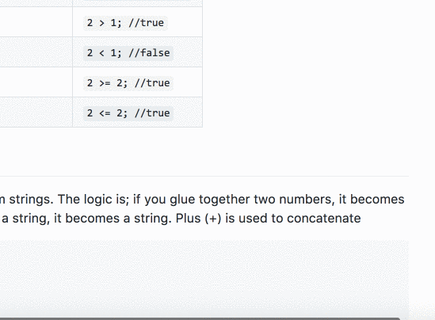

# JavaScript Dictionary
1. [.addEventListener](#addeventlistener)
2. [Anonymous functions](#anonymousfunctions)
3. [Arrays](#arrays)
4. [Boolean](#boolean)
5. [.classList](#classlist)
6. [callback](#callback)
7. [clearInterval](#clearinterval)
8. [Concatenation](#concatenation)
9. [The console](#theconsole)
10. [Datatypes](#datatypes)
11. [document](#document)
12. [DOM](#dom)
13. [Events](#events)
14. [Functions](#functions)
15. [if, else, else if](#ifelseelseif)
16. [Inline Scripts](#inlinescripts)
17. [Linking our JS files](#linkingourjsfiles)
18. [Math](#math)
19. [method](#method)
20. [Node](#node)
21. [NodeList](#nodelist)
22. [Number](#number)
23. [.querySelector](#queryselector)
24. [.querySelectorAll](#queryselectorall)
25. [.removeEventListener](#removeeventlistener)
26. [Selector](#selector)
27. [setInterval](#setinterval)
28. [setTimeout](#settimeout)
29. [State variables](#statevariables)
30. [Strings](#strings)
31. [.style](#style)
32. [variables, let, const & var](#variablesletconstvar)
## `.addEventListener`

A [method](#method) on [Nodes](#node) allowing us to hook up [events](#events). When the event occurs, it (JavaScript) fires of a "callback" (a function).

The function that receives the event receives information about the event as an argument (often called `e` because we're lazy)

Basic syntax

```javascript
someNode.addEventListener("event", callback);

function callback(e) {
  //do stuff
}
```

Often used with [anonymous functions](#anonymous-functions).

```javascript
someStuff.addEventListener("click", function(e) {
  //do stuff
});
```

And since ES6, with the "fat arrow" syntax:

```javascript
someElement.addEventListener("click", e => {
  //do stuff
});
```

## Anonymous functions

Anonymous functions are just that, anonymous. This means they don't have a name and cannot be called, except as a [callback](#callback).
See [.addEventListener](#addeventlistener) for an example.

## Arrays

A [datatype](#datatypes).
A list of values, stored in one variable. Really important when we don't necessarily know the number of values needed.

```javascript
//BAD!!
let student1 = "Jonas";
let student2 = "Alan";
//...
//GOOD
let students = ["Jonas", "Alan", "..."];
```

Accessing the elements is done using bracket notation and the "index" of the item (starting at 0)

```javascript
let hobbies = ["Beer", "Barbecue", "JS"];
let firstHobby = hobbies[0];
let lastHobby = hobbies[2];
```

To make this really clever, we need a [loop](#foreach)

### `.length`

A [property](#property) on [arrays](#arrays) & [strings](#string) telling us how many items are in it

```javascript
// with an array
let beers = ["IPA", "APA", "stout"];
let x = beers.length; // x is 3
// or with a string
let name = "Jonas";
let numChars = name.length; // numChars is 5
```

## Boolean

Booleans are a special [datatype](#datatypes) that can only contain the values `true` or `false` (no quotes). They are often used as "gates" / [state variables](#state-variables)

```javascript
let myDiv = document.querySelector("div");
let hasBeenClicked = false;
myDiv.addEventListener("click", divClicked);

function divClicked(e) {
  if (!hasBeenClicked) {
    //false, the first time
    console.log("Nice");
    hasBeenClicked = true;
  } else {
    console.log("Stop clicking me");
  }
}
```

## `.classList`

A [property](#property) on [nodes](#node). Not useful on it's own, but with the following three [methods](#method) it's extremely powerful.

### `.add`

Add a CSS-class to a [node](#node). If the node already has the class, nothing happens.

Consider the following HTML

```html
<div>
  <h1 class="main-heading">Hi mom</h1>
</div>
```

And the JS

```javascript
let header = document.querySelector("h1");
//let's add the highlight class to the <h1>
// possibly triggering awesome animations/transitions in the process
header.classList.add("highlight");

//and here, nothing happens, it already has the class
header.classList.add("main-heading");
```

### `.remove`

Remove a CSS-class from a [node](#node). If the node does not have the class, nothing happens.

```javascript
//chaining
document.querySelector("hi").classList.remove("main-heading");
// same as
let x = document.querySelector("h1");
x.classList.remove("main-heading");
```

### `.toggle`

Toggle a CSS-class on a [node](#node). If the node already has the class, it's removed, otherwise it's added.

```javascript
let x = document.querySelector("h1");
x.classList.toggle("active"); //now it's there
x.classList.toggle("active"); //now it's gone
```

## callback

A name for a function that is passed on, to be called at a later state. Look at [`clearInterval`](#clearinterval) where the `sayHi` function is the callback.

Callbacks are a core concept in JavaScript.

## `clearInterval`

Clears a timer set with [`setInterval()`](#setinterval)

```javascript
let count = 0;
let intervalId = setInterval(sayHi, 5000);

function sayHi() {
  count++;
  console.log("Hi, 5 seconds have passed");
  if (count === 5) {
    clearInterval(intervalId);
  }
}
```

## Concatenation

The process of "gluing" variables together to form strings. The logic is; if you glue together two numbers, it becomes a new number. If you glue together anything with a string, it becomes a string. Plus (+) is used to concatenate

```javascript
let a = 2;
let b = 3;
let c = "Hi";
let d = "4";

let e = a + b; //e is 5, addition
let f = d + d; //f is "34", concatenation
let g = a + b + c; //g is "5Hi", both
let h = a + "" + b; //h is "23"
```

## The `console`

An object in the browser, allowing us to write JS and see the output of our scripts in the browser. Not useful without it's [methods](#method). Have it open at all times!

### `console.log(msg)`

Outputs the content of a variable, expression etc, in the console.

```javascript
let x = document.querySelectorAll("p");
console.log(x);

console.log(2 > 1);
```

### Disabling the cache

When developing (and this goes for CSS too), caching can be quite irritating. So if you disable the cache (while devtools are open), you'll save yourself from lots of pain


## Datatypes

Used to describe the various types of data we can store in variables.
E.g. [Numbers](#number), [Strings](#string), [Arrays](#array), [Booleans](#boolean)

## `document`

The `document` is an object living inside the [`window`](#window) object. So technically, the document can be accessed with `window.document`, but we can also simply write `document`.

The document is the HTML that's loaded into the browser, including `<head>`, `<body>` etc.

w3schools maintain a [list of properties on the document object](https://www.w3schools.com/jsref/dom_obj_document.asp)

## DOM

_Document Object model_ is a term describing the relationship between [Nodes](#node) in the [`document`](#document). The main thing to understand is that the DOM is a hierachy, consiting of parents, siblings and children.

The following snippet will be used to describe the various relationships.

```html
<ul>
  <li><a href=""></a></li>
  <li><a href=""></a></li>
  <li><a href=""></a></li>
  <li><a href=""></a></li>
</ul>
```

### parent

Each node can have one, and only one parent. That is, the element that the node is nested inside. The `<html>` node is the only node that does not have a parent.

I the above example, each `<li>` is a parent to an `<a>`node, and the `<ul>` is the parent to all the `<li>`'s

### sibling

Each node can have a number of siblings. Siblings a re nodes nested on the same level, that have the same parent. In the example above, the `<li>`'s are siblings, the `<a>`s are not.

### children

You probably get this by now, above, the `<ul>` & `<li>`'s have children. `<ul>`has four, each `<li>` have one

## Events

See also [`.removeEventListener`](#removeeventlistener) and [`.addEventListener`](#addeventlistener). Events (another key concept in JS) are things that happen in our applications. The most common ones are listed below, but a lot of plugins add more, and [the full list](https://developer.mozilla.org/en-US/docs/Web/Events) is huge. We say that an event "fires" when someone or something triggers it.

The [callback](#callback) function that handles the event, receives an argument that contains information about the event. See the examples below.

### Common Events

| Event           | Action                                                              |
| --------------- | ------------------------------------------------------------------- |
| `animationend`  | Triggers when any CSS animation ends on the target                  |
| `click`         | When the user clicks the event target                               |
| `ended`         | Triggers when the target audio/video ends                           |
| `keyup`         | Triggers everytime a key (keyboard) is released                     |
| `load`          | Triggers when the page, all scripts and all stylesheets have loaded |
| `mouseout`      | Triggers when the mouse leaves the target                           |
| `mouseover`     | Triggers when the mouse enters the target element                   |
| `transitionend` | Triggers when any CSS transition ends on the target                 |

[MDN has a list that is a bit bigger :-)](https://developer.mozilla.org/en-US/docs/Web/Events)

### Examples

See [.addEventListener](#addeventlistener) for more examples.

#### `load`

```javascript
window.addEventListener("load", allReady);

function allReady() {
  // everything is loaded, we're good to go
}
```

#### `keyup`

```javascript
window.addEventListener("keyup", fingerLifted);

function fingerLifted(e) {
  // The callback receives an argument (here, I chose to call it e)
  console.log(e); //Look at the console, lot's of useful stuff in here
  /* for instance, e.code will tell us which key was pressed, with a simple if statement,
  we can start all sorts of crazy stuff */
  if (e.code === "KeyS") {
    //s key released
    //do whatever
  }
}
```

## Functions

Functions are a huge topic, so let's dive in. First off,

1. functions are named pieces of code that can be reused.
2. Secondly, they provide us with a new scope. This means, that variables declared inside the function is **only available inside that function**
3. They help us manage and structure our scripts as they grow

### Naming functions

Functions follow the same naming rules as [variables](#variables) and you can't (you can but shouldn't) call a functions the same thing you've called a variables, so the following is generally really bad:

```javascript
// BAD STUFF HERE!!!
var word = "here's text";
function word() {
  console.log("Do something");
}
```

### Function definitions

Defining a function is easy (although once you really get to learn the language, you'll see several other ways to do it). First off we have the `function` keyword, and then the name, followed by parenthesis () and finally the "body" of the function, wrapped in curly brackets {}

```javascript
function someMadeUpStuff() {
  //everything in here will get executed when the function is called
}
```

### Calling functions

Calling a function is also easy :-)

Once the function is defined, we add () after the function name to "call it"

```javascript
//defining it
function sayHello() {
  console.log("Hello");
}
//calling it
sayHello();
//and again
sayHello();
```

### Function parameters

Functions can receive arguments (often called parameters, the difference is not important now), which makes them really flexible.
These parameters become local variables in the function, let's see

```javascript
function sayHello(name) {
  //now this function has a local variable called `name`
  console.log("Hi " + name);
}
//calling it, and supplying a name, is as easy as
sayHello("Jonas");
```

So, when calling the function (as in `sayHello("Jonas")` ), the string "Jonas" is passed to the function, and in the function, it becomes the variable `name`.

The function does not know what name contains, and it doesn't care, in our example it just console.log's it.

To round off, we're gonna make a function that receives three parameters:

```javascript
function addItUp(a, b, c) {
  let sum = a + b + c;
  console.log("The sum is " + sum);
}
addItUp(2, 8, 5); // a = 2, b = 8, c = 5
```

### Functions as event listeners

Please see [.addEventListener](#addeventlistener) for usage. When using function as eventlisteners, they automatically receive 1 argument, information about the event. This argument is an object containing information about the event (such as when, where, what). Do a console.log on it to see what it contains.

### A few best practices

A (non-exhaustive) list of things to keep in mind.

1. Functions should do one thing, and one thing only
2. Name your functions wisely (you will get lost otherwise)
3. Keep it DRY (Don't Repeat Yourself)

## if, else, else if

Understanding [Booleans](#boolean) before proceeding is a really, really good idea :-)

We can make our code execute only if a specific condition is met using if, else if and else statements.

The if (and else if) statements takes an expression, evaluate it, and if the result is `true`the code in the following brackets is executed.

```javascript
let hobby = "JS"; //Let's imagine it comes from somewhere else
if (hobby === "Horses") {
  console.log("Good for you");
} else if (hobby === "Beer") {
  console.log("Great");
} else {
  console.log("Fantastic, " + hobby + " is a nice hobby");
}
```

## Inline Scripts

See also [Linking our JS files](#linking-our-js-files).

Besides having our JS in separate files, we can embed it directly in our HTML documents like this:

```html
...
<body>
  <div class="stuff"></div>
  ...
  <script>
    //here we go
  </script>
</body>
...
```

This limits code-reuse quite a lot, but it's excellent for quick tests

## Linking our JS files

See also [Inline Scripts](#inline-scripts)

The proper way of linking our script is like this:

```html
<script src="folder/file.js"></script>
```

And the best place to do it is right before closing the `<body>`-tag. That ensures that all the DOM elements are ready before we start manipulating them

## `Math`

`Math` is an object containing lots of useful methods concerning math. Stuff like rounding, PI, randomness etc are located here, let's take a look at a few of them.

### `.random()`

`Math.random()` will return a random number between 0 (inclusive) and 1 (not inclusive). Using a little bit of math, we can generate a random number in any range:

```javascript
let x = Math.random() * 11; //x is now a number between 0 and 10.99999999.....
```

### `.floor()`

`Math.floor()` takes number as argument, rounds it down and returns it, making it an ideal partner for [`Math.random()`](#random)

```javascript
let y = Math.floor(1.9); // y is now 1
//generating a random number between 0 & 10 (both inclusive)

let rand = Math.random(); // 0 - 0.99999....
rand = rand * 11; // 0 - 10.99999999....
rand = Math.floor(rand);

//or in one line
let rand = Math.floor(Math.random() * 11);
```

## method

Often used interchangeably with the term [function](#function), but there's a slight difference. A method is a function that lives on/in an object, and it's invoked using the dot operator. So `.querySelector()` is a method, that works on an element. `.random()` and it's brothers, are methods that work on the `Math` object.

## Node

A `node` is an element in the [DOM](#dom). It's what you get when you use [`.querySelector`](#queryselector). These nodes contain a lot more than meets the eye. Try selecting a node and do a console.dir on it:

```javascript
let b = document.querySelector("body");
console.dir(b);
```

## NodeList

A NodeList is a list of nodes, usually gotten via [.querySelectorAll](#queryselectorall). While not technically an [`array`](#array), it shares a lot of the same capabilities, it has a `.length` and we can loop through it.

## Number

A [Datatype](#datatypes) for.... numbers. Represents both integers (3) and floating point numbers (3.14).
If you have a string, you can convert it to a number with the Number "function":

```javascript
let x = 7; // a number
let a = "42"; // a string
let asANumber = Number(a); // convert "a" to a number
```

## `.querySelector`

`.querySelector` is a method we can use to grab elements in the DOM, including inline SVG elements!. The method can be used on the [document](#document) or on an already selected [node](#node).

We use it like this:
`element.querySelector(cssSelector)` The method returns the [node](#node)

```javascript
//Select the first <header> with the clss main in the DOM
let myHeader = document.querySelector("header.main");

// with an element selected, we can find that element's children
// find the first h1 inside myHeader
let h1 = myHeader.querySelector("h1");
```

## `.querySelectorAll`

Works just like [.querySelector](#queryselector), except it returns a [NodeList](#nodelist).

```javascript
// find all paragraphs in the document
let ps = document.querySelectorAll("p");
// or find all links in the header
let links = document.querySelectorAll("header a");
```

## `.removeEventListener`

Used to remove an existing eventlistener (previously set with [addEventListener](#addeventlistener)). The call to `removeEventListener` must have the exact same call back as the call to [.addEventListener](#addeventlistener). This means that events registered with anonymous functions are really difficult to remove.

```javascript
//first we register an eventlistener to an element
let terms = document.querySelector(".acceptTerms");
terms.addEventListener("click", termsClicked);

function termsClicked(e) {
  alert("You have accepted our terms");
  terms.removeEventListener("click", termsClicked);
}
```

For more, see [MDN](https://developer.mozilla.org/en-US/docs/Web/API/EventTarget/removeEventListener)

## Selector

In this case, a selector is a CSS selector used in JS. Methods such as [.querySelector](#querySelector) and [.querySelectorAll](#queryselectorall) use selectors to grab elements in the [DOM](#dom).

With the right selectors, we can grab almost anything, and getting good at the various CSS selectors will make our lives so much easier.

You can find [a great reference on w3schools](https://www.w3schools.com/cssref/css_selectors.asp)
and for an [awesome interactive tutorial at CSS Diner](http://flukeout.github.io/)

## `setInterval`

Execute a callback every X millisecond

```javascript
// setInterval(callback, interval)

function sayHi() {
  console.log("Hi");
}
// call the function sayHi ten times per second
setInterval(sayHi, 100);
```

See [clearInterval](#clearinterval) as well

## `setTimeout`

Works just like [setInterval](#setinterval) except, it only fires once.

```javascript
// Execute the callback after 2 seconds
setTimeout(() => {
  console.log("2 seconds passed");
}, 2000);
```

## State variables

State variables aren't really a JavaScript thing, it's a common concept in all programming languages. We declare a variable that has an initial state (value), and then we use that variable to decide what our program should do.

```javascript
let counter = 0; //this is our state variable

document.querySelector("p").addEventListener("click", e => {
  counter++;
  if (counter > 10) {
    console.log("You clicked the counter more than 10 times");
  }
});
```

## Strings

Yet another [datatype](#datatypes). A string is any combination of characters wrapped in ' or ", meaning that `"42"` is still a string. JavaScript does a thing called coercion for us, so that often we don't have to think too much about it, but there are several pitfalls. Example:

```javascript
let a = "42"; //a string
let b = 8; //a number
let c = ""; //a string
let d = "10";
let e = 2;

a + b; // gives the string "428", since one is a string, it does concatenation instead
b + e + d; //gives "1010", it first does math (8+2) and the concatenation
```

## `.style`

The `.style` property lives on [Nodes](#node), and allows us to **set** CSS properties. It does NOT allow us to read existing rules that were not set using `.style`.

CSS properties that have a dash (-) are "camelCased". So `background-color` becomes `backgroundColor`.

```javascript
// select the second li in the ul with id="main"
let li = document.querySelector("ul#main li:nth-child(2)");
//set/overqrite it's color & background-color
li.style.color = "red";
li.style.backgroundColor = "blue";
```

The `.style` property is the most important type of CSS, meaning that it will always take precedence over CSS written in a stylesheet, inline etc. Don't overuse it.

## variables, `let`, `const` & `var`

In JS we have three ways of creating variables, and each have their own advantages & disadvantages. `const` and `let` are new additions to the language, and not fully supported in all browsers, but for now, go ahead and use them.

### `var`

Fully supported, the old kid on the block.
Has "function scope", meaning that it's available everywhere in the function it's declared.

```javascript
var myName = "Jonas";

function sayHi() {
  //myName is available
  if (2 > 1) {
    var x = "Hi";
  }
  //x is available
}
```

### `let`

One of the new kids on the block. Has a "block scope", meaning that it's available in the block it was declared in

```javascript
let myName = "Jonas";
function sayHi() {
  //myName is available here
  if (2 > 1) {
    let x = "Hi";
    // x is ONLY available in this if statement
  }
}
```

### `const`

Another new kid. Has the same scope as `let` variables, but cannot be redeclared, and the value cannot change.

```javascript
const message = "Hi";
//ERROR:
message = "goodbye";

const students = [];
//FINE:
students.push("Jonas");
```
